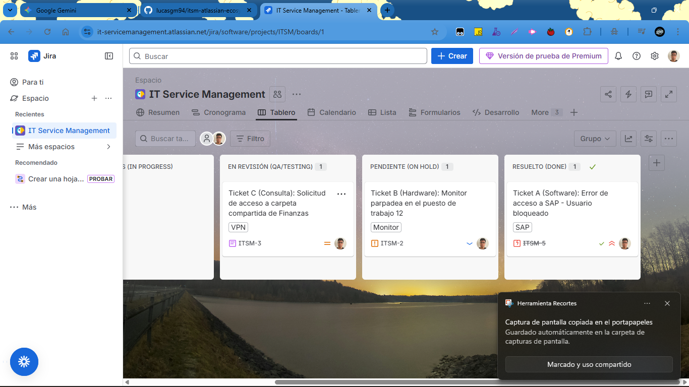
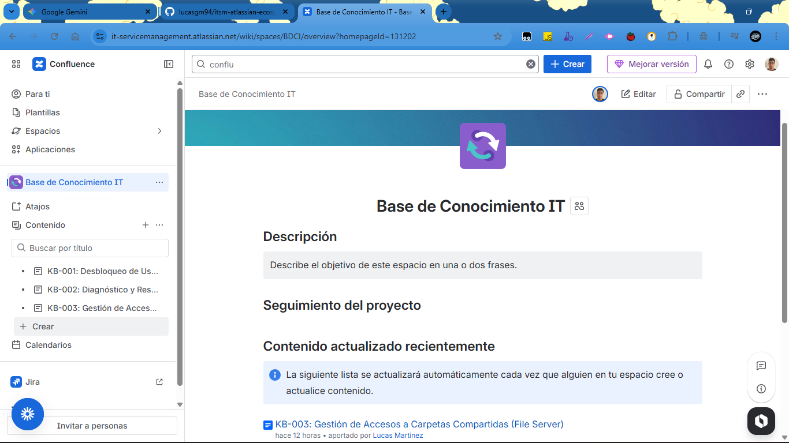
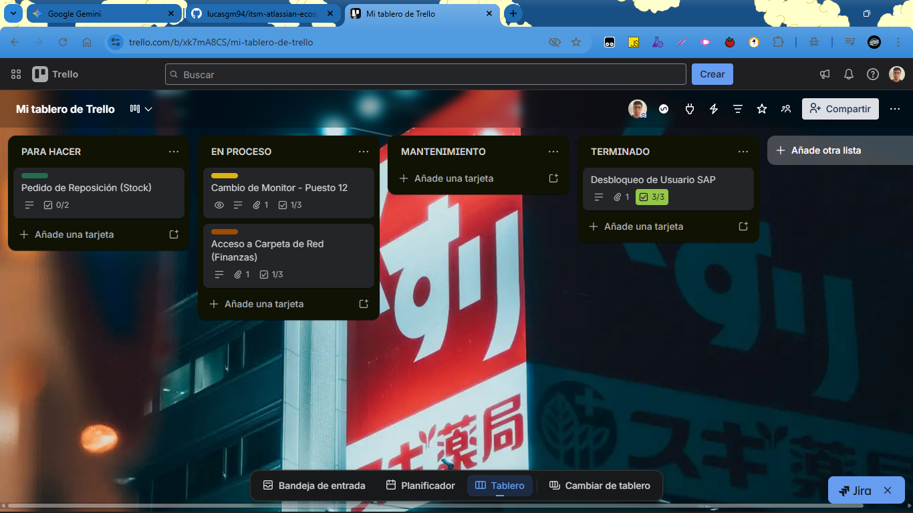

# ITSM Workflow: Jira + Confluence + Trello Integration 🚀

This repository documents a professional simulation of an **IT Service Management (ITSM)** ecosystem. The project demonstrates the end-to-end lifecycle of IT incidents, from user reporting to technical resolution and field operation tracking.

## 🛠️ Tech Stack
* **Jira Service Management:** Incident tracking, SLA management, and prioritization.
* **Confluence:** Centralized Knowledge Base (KB) and Standard Operating Procedures (SOPs).
* **Trello:** Operational Kanban for field support and inventory management.

---

## 📋 Project Scope
The implementation covers three real-world business scenarios:

1.  **Software Support (SAP Access):** Critical incident management for user unlocking.
2.  **Hardware Lifecycle (Monitor Replacement):** Troubleshooting and field support coordination.
3.  **Security & Compliance (Network Folders):** Access request management following corporate policies.

## 🖇️ Integration Architecture
The ecosystem is designed so that every tool serves a specific purpose:
* **The Brain (Jira):** Centralizes all incoming requests and monitors ticket status.
* **The Memory (Confluence):** Stores the "How-To" for every ticket, ensuring standardized solutions.
* **The Hands (Trello):** Manages the physical execution of tasks, linked directly to Jira via Power-Ups.

---

## 📂 Documentation (Knowledge Base)
Each ticket is backed by a specific entry in the Knowledge Base:
* **KB-001:** SAP User Unlock Procedure.
* **KB-002:** Hardware Diagnostics & Troubleshooting.
* **KB-003:** Access Control Policy for Shared Folders.

## 🖼️ Visual Workflow

### 1. Jira Service Desk

### 2. Confluence Documentation

### 3. Trello Operational Board

---

## 💡 Key Skills Demonstrated
* **ITIL Foundations:** Lifecycle management of Incidents and Service Requests.
* **Process Automation:** Linking cloud tools for seamless information flow.
* **Technical Documentation:** Writing clear, professional SOPs for IT teams.
* **Prioritization:** Managing urgency and impact levels in a high-demand environment.
